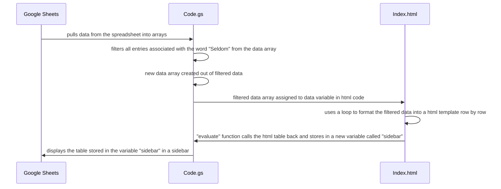

# MGT3745_HW4

## Summary
In short, the code works in three main steps: adding menu buttons to the user homescreen, filtering data according to standards, and displaying the new filtered data in a sidebar. 

I start my code with a **"filteredData"** function that I can later call on. In order to make this function work, I first use certain commands to get data from the spreadsheet and move it into arrays that I can later manipulate, transcribe, and otherwise work with. This array is named *data*. I then use a filter function to filter through the data array row by row. I created a new variable *filteredData* that was populated with the rows of the first array where the second column, located at index 1, did not equal "Seldom". This section of the code went through each line row by row, checked for "Seldom" in the appropiate spot, and only returned the row into the new array if "Seldom" was *not* there. 

After this I created a second file, Index.html. This file held the ability to create and format a table using a loop. In order to turn my filtered array, currently stored in filteredData, into a readable table, I created a template from the html file, assigned the filteredData array to the data variable in the html file, and let the file read the array and, row by row, format it into a table with headers. Using the *evaluate* function I pulled the formatted html table and stored it in a variable *sidebar*.

Using a user interface command I display sidebar on the screen. 

Now that filteredData is completely defined, I made adjustments to the menu. I made a function which had a variable that stored my changes, added a tab called "MGT3745", and then added an item under that tab in dropdown form called "Filtered Data", that I associated with the function "filteredData". This worked so that if the dropdown item was clicked the function would run. I added these changes to the user interface too. 

The final step was setting a function that would automatically change the menu upon opening the file. 

## Link
[Google Sheets Link](https://docs.google.com/spreadsheets/d/1DvhrLep1nabllAitCjjyU-hWRhmvtgHPQNbjLVhp1PI/edit?usp=sharing)

## Code
The most relevant chunks of code are the functions that exclude "Seldom" and contribute to the HTML formatting, as well as the function that adds a new tab to the menu.

To filter the data so that all entries with a frequency "Seldom" were removed, I created a new array and filled it with the results of a function that filtered through the current data array row by row and only returned rows where the the second column, located at index 1, did not contain the value "Seldom". 
```
var filteredData = data.filter(function(row) {
    return row[1] !== "Seldom";
  });
```


To see reuslts as far the html template, I created a template from the html code stored in Index.html, assigned the filtered data to a variable "data" in the Index.html code to let it run, then pulled that result back to the JavaScript/GAS code using evaluate. Because the result was a table, I also added a name, "Filtered Data". I stored this new table, formatted in html, as a new variable that could later be displayed. 
```
var html = HtmlService.createTemplateFromFile("Index");
  html.data = filteredData;
  var sidebar = html.evaluate().setTitle("Filtered Data");
```


To add a new tab to the menu I used a function in which I created a variable to capture the changes I was making to the UI. Then I used GAS functions to add a menu tab and dropdown items, before finally associating a function with one of the dropdown items so that in the event of interaction code actually ran. The "addToUi" function just displays the changes on the screen, or the user interface (UI).
```
function addMenu() {
  var menu = SpreadsheetApp.getUi().createMenu('MGT3745');
  menu.addItem('Filtered Data', 'filteredData');
  menu.addToUi(); 
}
```

## Diagram That Explains the "filteredData" Function

