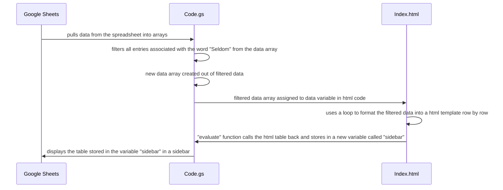

# MGT3745_HW4

## Summary

## Link

## Code
The most relevant chunks of code are the functions that exclude "Seldom" and contribute to the HTML formatting, as well as the function that adds a new tab to the menu.

To filter the data so that all entries with a frequency "Seldom" were removed, I created a new array and filled it with the results of a function that filtered through the current data array row by row and only returned rows where the the second column, located at index 1, did not contain the value "Seldom". 
```
var filteredData = data.filter(function(row) {
    return row[1] !== "Seldom";
  });
```


To see reuslts as far the html template, I created a template from the html code stored in Index.html, assigned the filtered data to a variable "data" in the Index.html code to let it run, then pulled that result back to the JavaScript/GAS code using evaluate. Because the result was a table, I also added a name, "Filtered Data". I stored this new table, formatted in html, as a new variable that could later be displayed. 
```
var html = HtmlService.createTemplateFromFile("Index");
  html.data = filteredData;
  var sidebar = html.evaluate().setTitle("Filtered Data");
```


To add a new tab to the menu I used a function in which I created a variable to capture the changes I was making to the UI. Then I used GAS functions to add a menu tab and dropdown items, before finally associating a function with one of the dropdown items so that in the event of interaction code actually ran. The "addToUi" function just displays the changes on the screen, or the user interface (UI).
```
function addMenu() {
  var menu = SpreadsheetApp.getUi().createMenu('MGT3745');
  menu.addItem('Filtered Data', 'filteredData');
  menu.addToUi(); 
}
```

## Diagram That Explains the "filteredData" Function

