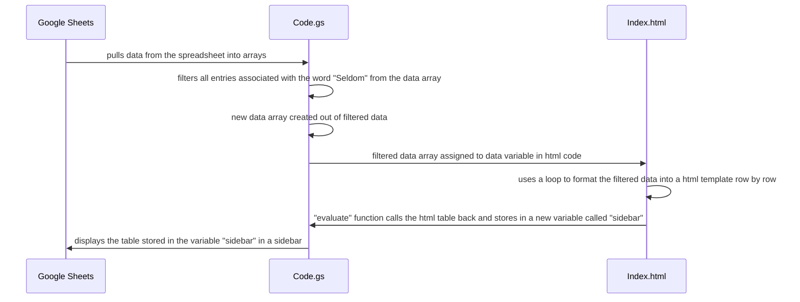

# MGT3745_HW4

## Summary

## Link

## Code

## Diagram That Explains the "filteredData" Function

```mermaid
sequenceDiagram
    participant Google Sheets
    participant Code.gs 
    participant Index.html 
    Google Sheets->>Code.gs: pulls data from the spreadsheet into arrays 
    Code.gs->>Code.gs: filters all entries associated with the word "Seldom" from the data array
    Code.gs->>Code.gs: new data array created out of filtered data
    Code.gs->>Index.html: filtered data array assigned to data variable in html code
    Index.html->>Index.html: uses a loop to format the filtered data into a html template row by row
    Index.html->>Code.gs: "evaluate" function calls the html table back and stores in a new variable called "sidebar"
    Code.gs->>Google Sheets: displays the table stored in the variable "sidebar" in a sidebar
```
